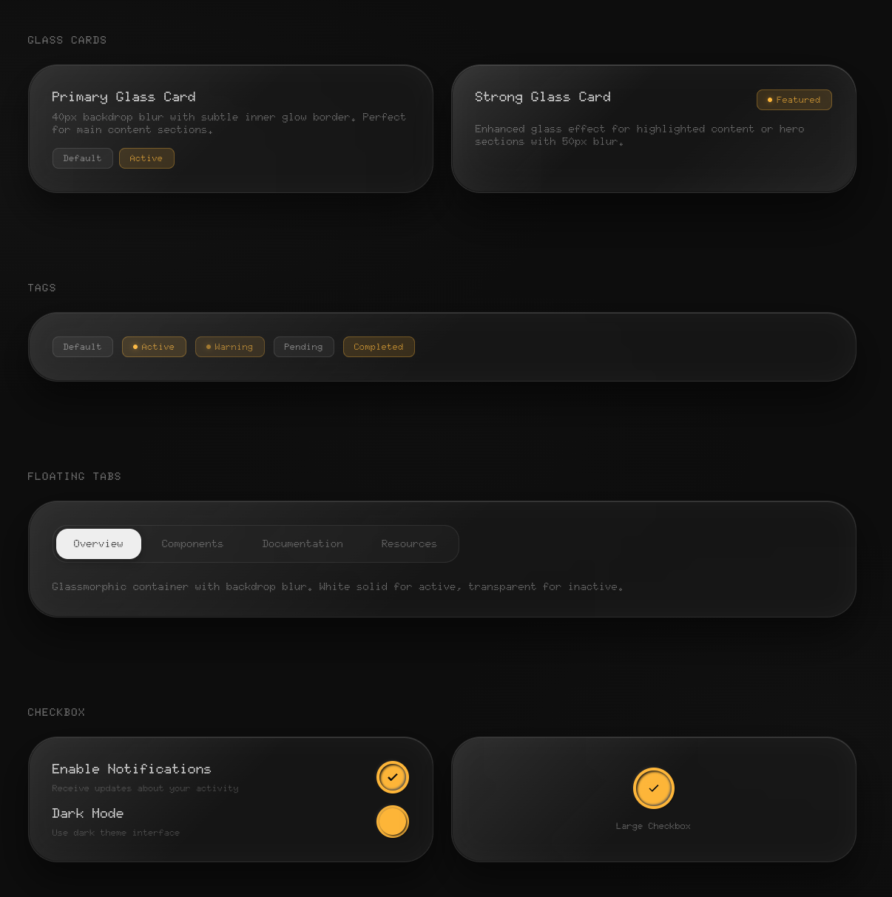
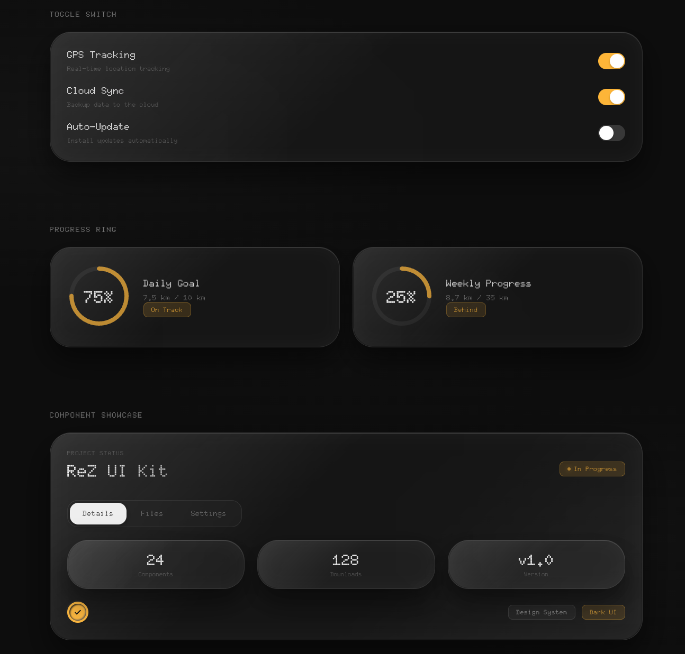

# ReZ Design System

A Claude Code skill for creating immersive dark glassmorphism UIs with frosted glass effects and subtle inner glow borders.




## Features

- Heavy frosted glass effects (40-50px backdrop blur)
- Subtle inner glow borders for glass depth
- Dark luxury aesthetic with pure black (#0A0A0A) background
- Floating tabs with active/inactive states
- Small rounded rectangle tags (not pills)
- Status indicators with glow effects
- Doto font family
- Yellow accent color (#FFBF17)
- Mobile-first responsive design

## Quick Start

Tell Claude `/ReZ` or describe what you want to design and it will apply these principles.

## Install

Copy the `ReZ` folder into your Claude Code skills directory:

```sh
cp -r ReZ ~/.claude/skills/
```

## What you get

| File | Content |
|------|---------|
| `SKILL.md` | Design philosophy, craft rules, workflow |
| `references/tokens.md` | Fonts, colors, spacing, glass effects |
| `references/components.md` | All UI component specifications |
| `references/platform-mapping.md` | HTML/CSS, Tailwind output conventions |

## Design Principles

1. **Dark luxury** — Pure black background with subtle light refractions
2. **Heavy glass** — 40-50px backdrop blur for frosted glass effect
3. **Inner glow** — Edge highlights create 3D depth
4. **Minimal accent** — Yellow (#FFBF17) used sparingly
5. **Smooth motion** — Cubic-bezier easing, natural transitions

## Color Palette

| Role | Value |
|------|-------|
| Background | #0A0A0A |
| Surface | rgba(45, 45, 45, 0.3) |
| Accent | #FFBF17 |
| Text Primary | rgba(255, 255, 255, 0.88) |
| Text Secondary | rgba(255, 255, 255, 0.45) |

## License

MIT
